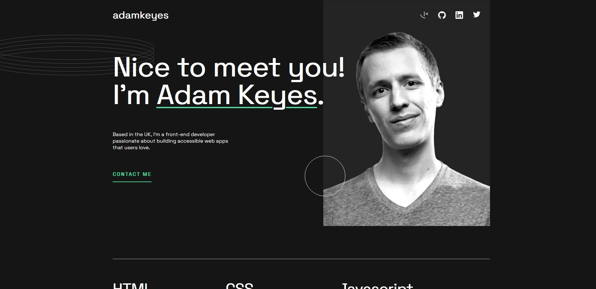
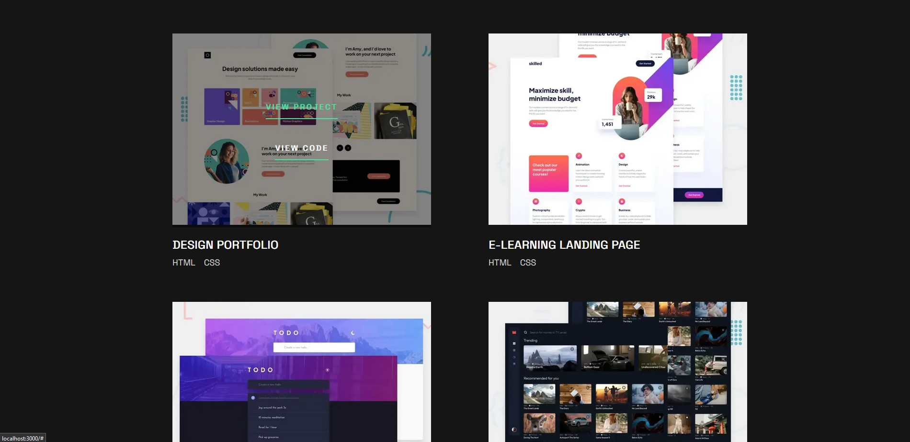
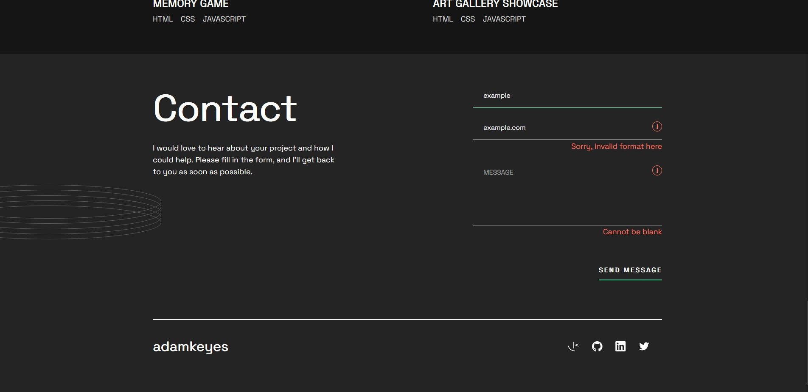

# Objective 

Create a developer profile for Adam Keyes.

Project provided by [FrontEnd Mentor](https://www.frontendmentor.io/challenges/singlepage-developer-portfolio-bBVj2ZPi-x).

**FrontEnd Mentor**

Provide images, Figma design, and text for the website.

## Technology

### Next.js
Next.js ia a framework created by Vercel.

**Run**

`npm run dev`

### FrontEnd
- HTML
- CSS
- JavaScript

## Screenshots

    

        
<b>Desktop</b>

        
    

    

        
<b>Tablet</b>

        
    

    

        
<b>Phone</b>

        
    

**Active**

    

        
<b>Contact Button on Hover</b>

        
    

    

        
<b>Project Overlay</b>

        
    

    

        
<b>Contact Form Submission</b>

        
    

